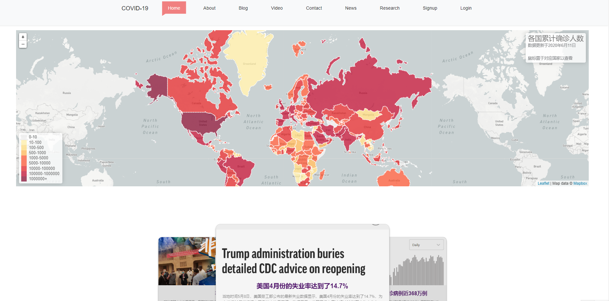
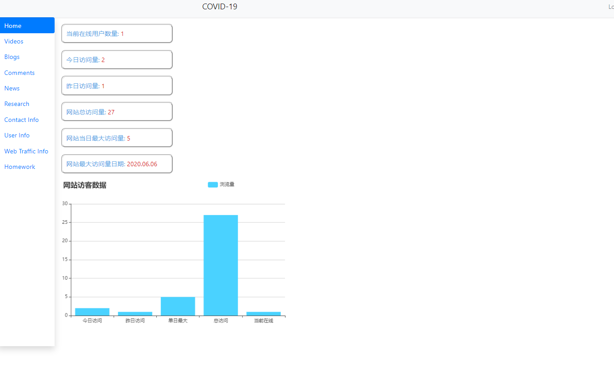

<h3 align="center">疫情资料站</h3>
<h6 align="center">《互联网数据库开发》团队-布利啾啾迪布利多</h6>

For *Internet Datebase Development* 2020 Spring @Nankai University,
By [Jingzhi Huang](https://github.com/NebulaJZ), [Yanxin Li](https://github.com/Liyx55), [Jiayi Sun](https://github.com/Guru759), [Yunkai Xu](https://github.com/MilkyBoat), [Jiawei Yuan](https://github.com/tenkinoko)
<br>

>[前台](http://covid.milkyship.cn) [后台](http://covid.milkyship.cn/backend/web)

>作业可在[这里](http://covid.milkyship.cn/backend/web/site/homework)下载，存储于data文件夹下

网站简介😄
----------

本网站以“COVID-19”为主题，主要分为前台、后台两个部分。
用户可以进入前台进行登陆注册，来获得后台的访问权限，在前台可以进行查看新冠肺炎在全球各国的当日最新确诊数量、了解关于新冠肺炎的基本信息以及相关的热点新闻；在blog和video页面还可以看到疫情相关的视频和文章。
进入后台时需要用户登陆后才可以进行访问，可以查看网站访问量；发布文章、视频、新闻、研究等等；查看前台留下的评论和使用者的信息、网络流量信息和团队的作业等。

>[用户手册看这里！🎈](data/team/布利啾啾迪布利多_用户手册(1810729_1810756_1813265_1713667_1810546).pdf)
---




[](https://packagist.org/packages/yiisoft/yii2-app-advanced)
[](https://packagist.org/packages/yiisoft/yii2-app-advanced)
[](https://travis-ci.com/yiisoft/yii2-app-advanced)

文件目录结构
-------------------

```
common
    config/              contains shared configurations
    mail/                contains view files for e-mails
    models/              contains model classes used in both backend and frontend
    tests/               contains tests for common classes    
console
    config/              contains console configurations
    controllers/         contains console controllers (commands)
    migrations/          contains database migrations
    models/              contains console-specific model classes
    runtime/             contains files generated during runtime
backend
    assets/              contains application assets such as JavaScript and CSS
    config/              contains backend configurations
    controllers/         contains Web controller classes
    models/              contains backend-specific model classes
    runtime/             contains files generated during runtime
    tests/               contains tests for backend application    
    views/               contains view files for the Web application
    web/                 contains the entry script and Web resources
frontend
    assets/              contains application assets such as JavaScript and CSS
    config/              contains frontend configurations
    controllers/         contains Web controller classes
    models/              contains frontend-specific model classes
    runtime/             contains files generated during runtime
    tests/               contains tests for frontend application
    views/               contains view files for the Web application
    web/                 contains the entry script and Web resources
    widgets/             contains frontend widgets
vendor/                  contains dependent 3rd-party packages
environments/            contains environment-based overrides
```
